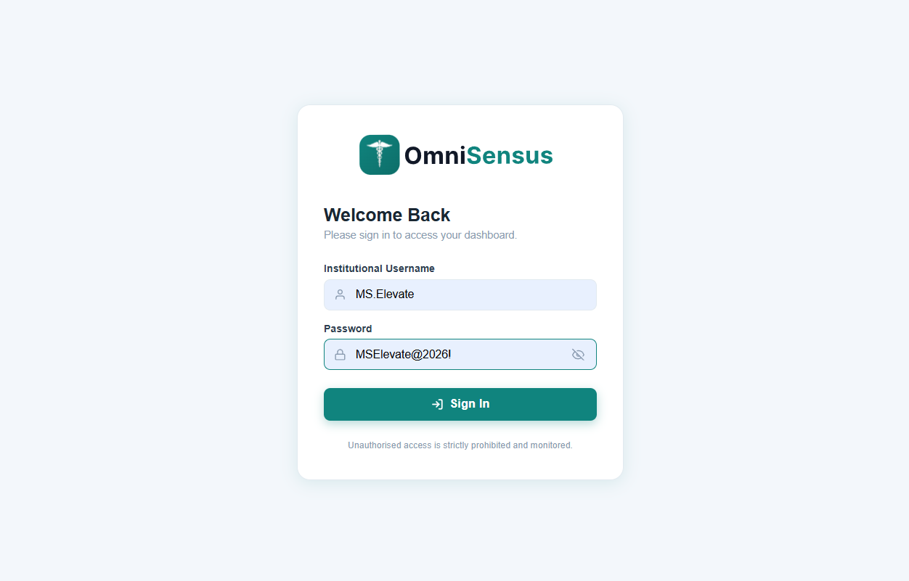
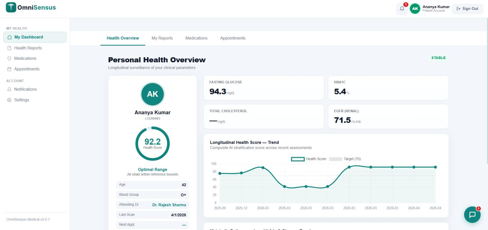
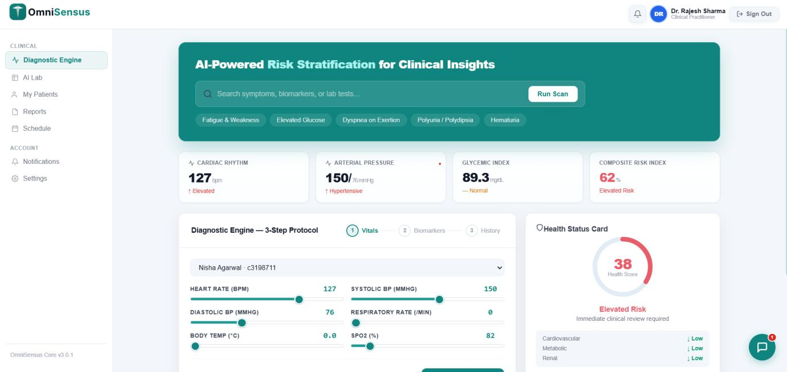
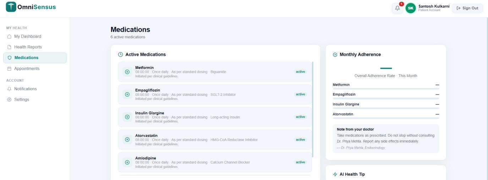
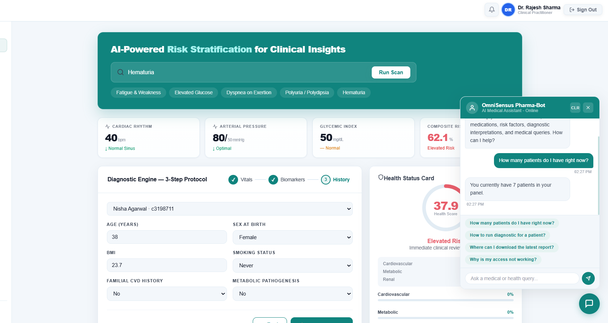

# OmniSensus — End-to-End AI Survey & Analytics Platform (Main Documentation Hub)

OmniSensus is an end-to-end platform that combines a modern web frontend, a Python backend API, and a Python-based AI/ML analytics layer to deliver survey creation, response collection, and automated insight generation.

This repository (**research_documentations**) is the **main hub** for anyone who wants to understand the full project: architecture, learning resources, reports, demos, and visual previews.

---

## Repositories (Project Modules)

OmniSensus is split into three primary repositories:

1. **Frontend (Web App)** — `omnisensus-website`  
   - UI, dashboards, and client-side interaction  
   - Tech: JavaScript + CSS  
   - Repo: https://github.com/parthvadodariya-616/omnisensus-website

2. **Backend (API Service)** — `OmniSensus-Backend`  
   - REST APIs, auth, survey management, integration endpoints  
   - Tech: Python  
   - Repo: https://github.com/parthvadodariya-616/OmniSensus-Backend

3. **AI/ML Layer (Analytics Engine)** — `OmniSensus-ML_model`  
   - NLP + ML pipelines for insights, segmentation, prediction, reporting  
   - Tech: Python (+ some HTML reporting)  
   - Repo: https://github.com/parthvadodariya-616/OmniSensus-ML_model

---

## What This Repository Contains

This repository is a documentation and archival space, including:
- Internship/capstone deliverables (reports, presentations, learning guides)
- Product overview documents
- Technical research documents and diagrams
- Visual previews (UI + workflow visuals)

Key documents you’ll find in the root include PDFs/DOCX/PPTX such as:
- Product overviews
- Technical research documentation
- Final report with diagrams
- Internship report and presentation materials

---

## System Architecture (High Level)

### Frontend (Web)
- Presents dashboards (survey creation, response viewing, analytics visualization)
- Calls backend endpoints via REST
- Focus: UX, responsive UI, charts, admin flows

### Backend API
- Manages: authentication, users, surveys, response storage, orchestration
- Exposes endpoints that the frontend consumes
- Bridges requests to the ML analytics service/module

### AI/ML Analytics
- Processes survey responses (text + structured responses)
- Generates insights: sentiment, clusters/segments, trends, predictions
- Produces results that can be displayed in dashboards or reports

---

### Embedded View
#### Login

#### Patient Dashboard

#### Doctor Dashboard

#### Medication (Patient Module)

#### Chatbot Support

---

## How to Use This Project (Recommended Reading Order)

If you are new and want to understand everything end-to-end:

1. Start here in **research_documentations** to learn the full concept and review reports/diagrams.
2. Open the **Frontend repo** and run the website locally to understand UX + flows.
3. Open the **Backend repo** to understand API endpoints, data models, authentication, survey lifecycle.
4. Open the **ML repo** to understand analytics pipelines, model logic, and insight generation.

---

## Open Source / Free to Use

This is intended to be **free to use** and reusable for:
- learning & teaching
- academic projects
- research
- prototypes and product experiments

See the repository **LICENSE** file (if present) for the exact terms.

---

## Contributing

Contributions are welcome:
- documentation fixes
- architecture clarifications
- improving setup instructions in the module repos
- adding diagrams / flowcharts
- improving preview organization and naming consistency

---

## Maintainer

**Parth Vadodariya**
